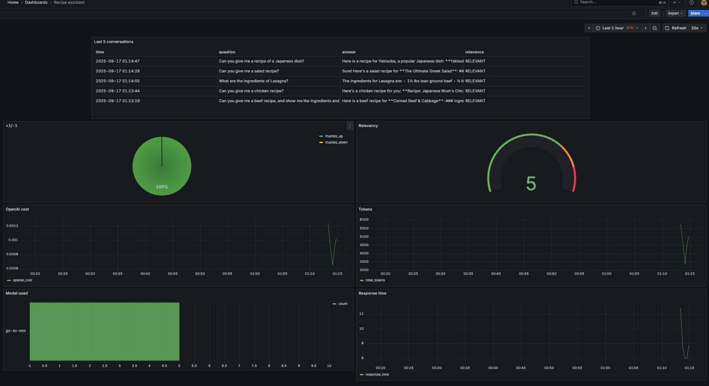

# RAG-based Cooking Assistant

Capstone project for [DataTalksClub's LLM Zoomcamp](https://github.com/DataTalksClub/llm-zoomcamp/tree/main) (2025).

## Description

This projects works on a `Retrieval-Augmented Generation (RAG) cooking assistant` that provides step-by-step recipes and culinary guidance. 

Simply ask for a dish, and the assistant is able to return

* Ingredient lists
* Preparation and cooking steps
* Helpful tips

## Datasets

The recipes are scraped from [Food.com](Food.com) - **88 All-Time Best Dinner Recipes**.

## Technologies
- `Python 3.12`
- `OpenAI` (LLM provider)
- `uv` (Python package and project manager)
- `Docker` and `Docker Compose` (containerization)
- `FastAPI` (API interface - see [Background](#background) for more information)
- `Qdrant` (vector database) 
- `PostgreSQL` for conversations and feedback storage
- `Grafana` (monitoring)

## Project Structure
```bash
recipe-rag-assistant/
│── data/                   # source data, ground truth and evaluation results
│   ├── ground-truth-retrieval.csv
│   ├── rag-eval-gpt-4o-mini.csv
│   ├── rag-eval-gpt-4o.csv
│   ├── recipes.csv
│── recipe_assistant/       # Application code and experiment notebooks
│   ├── app/                # FastAPI project
│   │   ├── main.py         # Entry point
│   │   ├── api/            # API endpoints
│   │       ├── endpoints.py
│   │   ├── core/           # Configs
│   │       ├── config.py
│   │   └── models/         # Pydantic models
│   │       ├── schemas.py
│   ├── db.py               # Database setup and operations
│   ├── rag.py              # RAG logic (retrieval + generation)
│   ├── ingest.py           # Document ingestion into Qdrant
│   └── scrape_recipes.py   # Scraping Food.com recipes
│   └── api_example.http    # Sample HTTP requests
│── grafana/                # Monitoring with Grafana
│   ├── init.py             # Initialize Grafana datasource + dashboard
│   └── dashboard.json      # Dashboard configuration
│── notebooks/              # Jupyter notebooks for experiments
│   ├── rag-test.py         # RAG pipeline flow testing
│   ├── evaluation-data-generation.ipynb         # Generate ground truth for evaluation
│── .env # Envrionment variables (API keys, database configs, etc.)
│── .gitignore
│── .dockerignore
│── docker-compose.yaml # Docker Compose for the servies
│── Dockerfile # Dockerfile for running the FastAPI application servie
│── pyproject.toml # Configuration file for dependencies and packaging (used by uv)
│── uv.lock # Project dependencies and packaging for the project (used by uv)
│── requirements.txt # Project dependencies (can be used by uv or pip)
│── README.md # Project documentation
```
## Using the application

### Preparing the Python environment

We recommend using `uv` for this project. You can install `uv` by following the [instruction](https://docs.astral.sh/uv/getting-started/installation/#installation-methods) from its official website. 

If you are not able to install `uv`, you can still use `pip` to install the requirements with the [requirements.txt](requirements.txt).

Please always create a `Python virtual environment` before installing any packages and running any scripts/notebooks locally.

**MacOS/Linux example:**

This will create a `.venv` for you
```bash
uv sync --locked
source .venv/bin/activate
```

If you prefer a customized name of your virtual env, use the following command:

```bash
uv venv my-env # creates a virtual env named 'my-env'

source my-env/bin/activate # activate the virtual env

uv pip install -r requirements.txt
```

### Preparing the environment variables
You should create an `.env` file that stores your OpenAI API key in the project folder. In addition, we put some other parameters that will be used by the app.

```bash
# example
OPENAI_API_KEY=YOUR_OPENAI_API_KEY
QDRANT_URL=http://localhost:6333

# PostgreSQL Configuration
POSTGRES_HOST= postgres # localhost
POSTGRES_DB=recipe_assistant
POSTGRES_USER=recipe_user
POSTGRES_PASSWORD=recipe_user_pwd
POSTGRES_PORT=5432

# Grafana Configuration
GRAFANA_ADMIN_USER=admin
GRAFANA_ADMIN_PASSWORD=admin
GRAFANA_SECRET_KEY=SECRET_KEY
```

### Scraping the source data (Optional)

The source data is saved in [recipes.csv](data/recipes.csv). However, you can run the following script if you are interested in scraping the data yourself.

```bash
# If you have uv installed
cd recipe_assistant
uv run scrape_recipes.py
```

### Running the application

You need to spin up the services via `docker-compose`.

Inside the root directory: [recipe-rag-assistant](./), run
```bash
docker compose up
```
Wait until all services are ready. You can check it from the docker logging messages in the terminal.

- Our FastAPI application will be available at http://localhost:8000/. Accessing this localhost will give you the following message:
```json
{"message":"Welcome to the recipe assistant application!"}
```
- FastAPI generates the API docs for us: http://localhost:8000/docs/

#### Database configuration
The database will be initialized once the application starts. To check the content of the database, use `psql`:

```bash
psql -U recipe_user -h localhost -p 5432 -d recipe_assistant
```

You will be asked to enter the password. It is defined in the `.env` file: `POSTGRES_PASSWORD`.

You can view the tables using `\dt` command:

```sql
\dt
```

You can select from the tables:
```sql
select * from conversations;
```

## Monitoring

We use `Grafana` to monitor the application. 

### Setting up Grafana

The complete configuration can be found in the [`grafana`](grafana/) folder.

* [`init.py`](grafana/init.py): the python script that initializes the datasource and the dashboard.
* [`dashboard.json`](grafana/dashboard.json): the actual dashboard (taken from the [2024 cohort](https://github.com/DataTalksClub/llm-zoomcamp/blob/main/cohorts/2024/04-monitoring/dashboard.json) of LLM Zoomcamp).

The `Grafana` service is started once you run the `docker-compose` file. Once the service is started, run the following command in your terminal:

```bash
cd grafana

# make sure the POSTGRES_HOST variable is not overwritten 
env | grep POSTGRES_HOST

uv run init.py
```

Once the setup is completed, you can access the dashboard at http://localhost:3000/.

### Dashboards


The monitoring dashboard contains the following panels:

1. **Last 5 conversations (table):** This table displays the latest 5 conversations, including question, answer, relevance, and conversation timestamp.

2. **+1/-1 (pie chart):** This pie chart visualizes the feedback from users. `thumbs_up` represents positive feedbacks, and `thumbs_down` shows negative feedbacks.

3. **Relavancy (gauge chart):** This gauge chart summarizes the relevance of the responses for each conversation. The relevance is evaluated by LLM.

4. **OpenAI cost (time series):** This is a time series chart that tracks the cost incurred by using OpenAI services.

5. **Tokens (time series):** This is another time series chart that tracks the token usage for each conversation.

6. **Model used (bar chart):** This bar chart displays the count of LLM models used by the conversations.

7. **Response time (time series):** This time series chart tracks the response time of each conversation.

## Experiment

For experiments, we use Jupyter notebooks. They are saved in [`notebooks`](notebooks/) folder.

Use your preferred IDE (Anaconda, VSCode and etc.) to run the notebooks.

We have the following notebooks:
- [`rag-test.ipynb`](notebooks/rag-test.ipynb): RAG flow and the evaluation of the system
- [`evaluation-data-generation.ipynb`](notebooks/evaluation-data-generation.ipynb): Generate the ground-truth dataset with the LLM for retrieval evaluation. 

### Retrieval evaluation

The basic approach uses `sparse vector search` from `Qdrant` using model `bm25`.

- Hit rate: 100.000%
- MRR: 97.206%

The `dense vector search` from `Qdrant` gives the following results (model used: `jinaai/jina-embeddings-v2-small-en`):

- Hit rate: 100.000%
- MRR: 98.985%

The `Hybrid search` from `Qdrant` gives the following results:

- Hit rate: 100.000%
- MRR: 99.091%

The `Hybrid search` approach has the beset results, compared with other two search.

### RAG flow evaluation

We used the LLM-as-a-Judge metric to evaluate the quality
of our RAG flow.

For `gpt-4o-mini`, we had:

- 424 (96%) `RELEVANT`
- 12 (2%) `PARTLY_RELEVANT`
- 4 (1%) `NON_RELEVANT`

For `gpt-4o`, we had:

- 418 (95%) `RELEVANT`
- 18 (4%) `PARTLY_RELEVANT`
- 4 (1%) `NON_RELEVANT`

Interestingly, `gpt-4o-mini` has a better performance than `gpt-4o`.

## Background

Here we provide a brief introduction to `FastAPI` which is not used in `LLMZoomcamp`.

### FastAPI
We use `FastAPI` for creating the API interface for our application. 

[`FastAPI`](https://fastapi.tiangolo.com/) is a modern, fast (high-performance), web framework for building APIs with Python based on standard Python type hints.

In our case, we send questions to `http://localhost:8000/api/v1/question`.